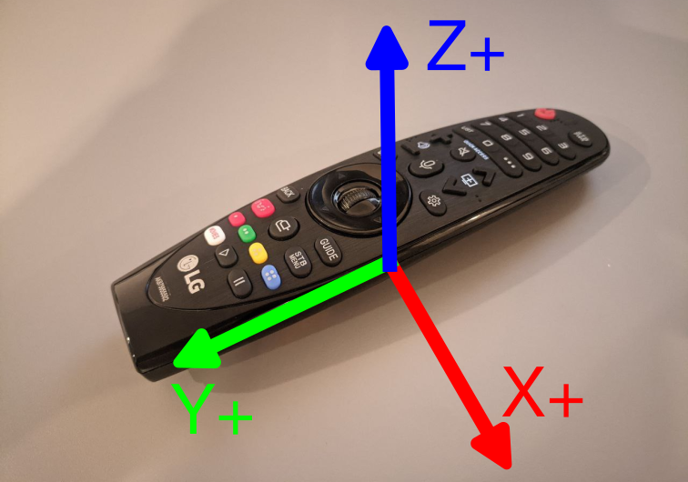

# Драйвер LG Magic Remote (MR20) для Linux и набор инструментов
**Язык:** [English🇬🇧](README.md) | **Русский🇷🇺**



## Описание

Этот проект предоставляет комплексный драйвер для ядра Linux и набор инструментов для пульта LG Magic Remote (MR20 и аналогичных). Драйвер обеспечивает полную функциональность пульта, включая назначение кнопок, гироскопическое управление курсором (аэромышь) и прямой доступ к данным IMU (акселерометр и гироскоп). Пакет включает как модуль ядра, так и утилиты на Python для калибровки, тестирования и визуализации.

## Структура проекта

### Файлы модуля ядра

- **kernel/dkms.conf** - файл конфигурации DKMS для автоматической сборки модуля ядра
- **kernel/lg_magic_main.c** - реализация драйвера ядра
- **kernel/lg_magic_airmouse.h** - заголовочный файл структуры калибровочных значений 
- **kernel/lg_magic_airmouse.c** - реализация калибровки и фильтрации аэромыши
- **kernel/Makefile** - система сборки для модуля ядра
- **51-lgimu.rules** - правило udev для доступа к необработанным данным IMU без прав суперпользователя. Разместить в `/etc/udev/rules.d/` при необходимости.

### Инструменты Python

- **scripts/lg_magic.py** - Низкоуровневый анализатор пакетов. Изначальный инструмент, сохранен для истории
- **scripts/calibrate.py** - Утилита калибровки IMU
- **scripts/convert_calib.py** - Конвертер калибровки в бинарный формат для модуля ядра
- **scripts/display_imu.py** - Утилита визуализации IMU в реальном времени и эмуляция аэромыши

## Возможности модуля ядра

### Поддержка устройств
- Поддерживает LG Magic Remote (HID Bluetooth устройство 000f:3412)
- Создает два устройства ввода:
  - `LG Magic Remote` - стандартные HID события (кнопки, колесо, аэромышь)
  - `LG Magic Remote IMU` - сырые данные IMU (акселерометр + гироскоп)

### Назначение кнопок
Полная поддержка кнопок включая:
- Включение, цифровые клавиши (0-9), навигационные кнопки (UP/DOWN/LEFT/RIGHT)
- Медиа-управление (PLAY, PAUSE, VOLUME, MUTE)
- Цветные кнопки (RED, GREEN, YELLOW, BLUE)
- Специальные функциональные кнопки (HOME, BACK, SETTINGS, GUIDE)

### Функциональность аэромыши
**Требует калибровки перед использованием**
- Управление курсором на основе гироскопа
- Настраиваемая чувствительность и порог активации
- Фильтр низких частот для сглаживания движения
- Автоматическое переключение между кнопочным управлением и аэромышью

Функция аэромыши реализована двумя способами:
- **Модуль ядра (Рабочий)**: Встроенная обработка аэромыши с минимальной задержкой, полностью в пространстве ядра
- **Python + Uinput (Отладочный)**: Обработка сырых данных IMU в пользовательском пространстве через `display_imu.py --mouse` для тестирования и проверки калибровки

### Доступ к данным IMU
- Сырые данные акселерометра и гироскопа через evdev
- 6-осевые данные движения (3 оси акселерометра + 3 оси гироскопа)
- Счетчик для синхронизации времени

## Сборка и установка

### Предварительные требования
- Заголовки ядра Linux
- DKMS (Dynamic Kernel Module Support)
- Базовые инструменты сборки (make, gcc)

### Ручная сборка
```bash
make
sudo insmod lg_magic.ko
```

### Установка через DKMS
```bash
sudo mkdir /usr/src/lg-magic-1.0
sudo cp * /usr/src/lg-magic-1.0/
sudo dkms add -m lg-magic -v 1.0
sudo dkms build -m lg-magic -v 1.0
sudo dkms install -m lg-magic -v 1.0
```

### Параметры модуля
Драйвер поддерживает некоторые параметры:

```bash
# Загрузка с пользовательскими параметрами
sudo modprobe lg_magic airmouse=1 airmouse_threshold=300 imu_evdev=1 debug=2

# Или установка через sysfs после загрузки
echo 1 > /sys/module/lg_magic/parameters/airmouse
echo 500 > /sys/module/lg_magic/parameters/airmouse_threshold
echo 2 > /sys/module/lg_magic/parameters/debug
```

**Параметры:**
- `airmouse` (0/1): Включить/выключить функциональность аэромыши
- `airmouse_threshold` (int): Пороговое значение гироскопа для активации аэромыши (по умолчанию: 300)
- `imu_evdev` (0/1): Предоставлять сырые данные IMU как отдельное устройство ввода
- `debug` (0-2): Уровень отладочных сообщений (0=без сообщений, 1=нормальный, 2=подробный)

## Система калибровки

### Формат файла калибровки
Драйвер загружает данные калибровки из бинарных файлов через подсистему Linux Firmware:
- `lg_magic_calib_XX_XX_XX_XX_XX_XX.bin` - Индивидуальный калибровочный файл по MAC-адресу
- `lg_magic_calib.bin` - Калибровка по умолчанию

### Создание файлов калибровки

1. **Сбор данных IMU для обеих калибровок:**
```bash
python3 display_imu.py --csv samples.csv
```

2. **Вычисление калибровочных значений:**
```bash
# Калибровка акселерометра (медленно вращайте по всем осям во время сбора данных)
python3 calibrate.py --accel samples.csv calib_accel.json

# Калибровка гироскопа (держите пульт неподвижно во время сбора данных)
python3 calibrate.py --gyro samples.csv calib_gyro.json

# Объединение JSON
Объедините разделы gyro/accel. Настройте коэффициент гироскопа. Выходит за рамки этого проекта, рекомендуемое значение около 0.07
```

3. **Конвертация в бинарный формат:**
```bash
python3 convert_calib.py calib.json lg_magic_calib.bin --alpha 0.2 --mouse_k 0.5
```

### Параметры калибровки
- `alpha`: Коэффициент фильтра низких частот (0.0-1.0)
- `mouse_k`: Множитель чувствительности аэромыши
- `gyro_bias`: Значения дрейфа гироскопа
- `gyro_scale`: Коэффициенты гироскопа

## Использование инструментов Python

### lg_magic.py - Анализатор пакетов
```bash
# Мониторинг HIDRAW пакетов
python3 lg_magic.py
```

### display_imu.py - Визуализация IMU
```bash
# Отображение сырых данных IMU
python3 display_imu.py

# AHRS
python3 display_imu.py --calib calib.json --ahrs

# 3D куб
python3 display_imu.py --calib calib.json --cube

# Аэромышь через uinput
python3 display_imu.py --calib calib.json --mouse
```

### Отладка аэромыши
Инструменты Python могут создавать виртуальное устройство мыши используя uinput:

```bash
# Включение модуля uinput
sudo modprobe uinput

# Запуск аэромыши
python3 display_imu.py --calib calib.json --mouse
```

## Технические детали

### Структура HID протокола

Пульт использует report ID `0xFD` (30 байт всего: 1 байт report ID + 29 байт полезной нагрузки). Структура полезной нагрузки:

| Смещение | Размер | Описание | Формат |
|----------|--------|----------|---------|
| 0 | 1 | Report ID (0xFD) | uint8_t |
| 1-2 | 2 | Счетчик пакетов | uint16 little-endian |
| 3-4 | 2 | Константа (0xFD00) | uint16 little-endian |
| 5-6 | 2 | Гироскоп X | int16 big-endian |
| 7-8 | 2 | Гироскоп Y | int16 big-endian |
| 9-10 | 2 | Гироскоп Z | int16 big-endian |
| 11-12 | 2 | Акселерометр X | int16 big-endian |
| 13-14 | 2 | Акселерометр Y | int16 big-endian |
| 15-16 | 2 | Акселерометр Z | int16 big-endian |
| 17-18 | 2 | Код кнопки | uint16 big-endian |
| 19 | 1 | Колёсико | int8 |

Другие типы отчетов (0xF9, 0x01) не наблюдались, возможно используются для других функций (например, микрофона)

### Обработка данных IMU
- **Частота дискретизации**: ~50Hz (интервалы 20ms)
- **Формат данных**: 16-битные знаковые значения big-endian
- **Система координат**: Показана на рисунке

### Алгоритм аэромыши
1. Данные гироскопа корректируются по дрейфу и масштабируются
2. Фильтр низких частот уменьшает высокочастотный шум
3. Угловая скорость преобразуется в движение курсора
4. Пороговое переключение между кнопочным управлением и аэромышью по угловой скорости. Нажатие кнопок возвращает кнопочный режим.

## Расположение в файловой системе

- **Модуль**: `/lib/modules/$(uname -r)/kernel/drivers/input/misc/lg_magic.ko`
- **Калибровка**: `/lib/firmware/lg_magic_calib.bin`
- **Исходники DKMS**: `/usr/src/lg-magic-1.0/`

## Совместимость

- **Протестировано с**: LG Magic Remote MR20
- **Версии ядра**: 4.15+ (тестировалось на 6.11)
- **Python**: 3.6+
- **Зависимости**: numpy, scipy, pyqtgraph, python-evdev

## Участие в разработке

Пожалуйста, сообщайте об проблемах и отправляйте pull requests для:
- Поддержки дополнительных устройств
- Улучшения алгоритмов калибровки
- Исправления ошибок и улучшения производительности

## Лицензия

GPL v2 - Такая же как у ядра Linux

Copyright © 2025 [Илья Челядин]. Этот проект не аффилирован с LG Electronics.
